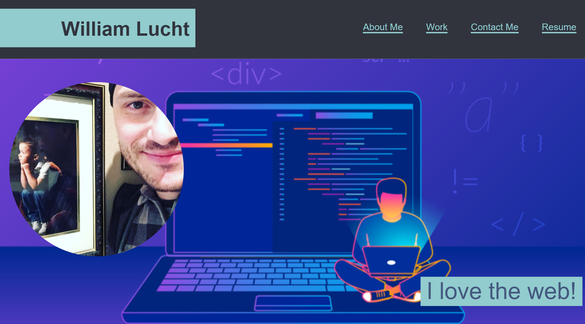

# William Lucht's Flexbox Portfolio

## Description
The motivation for this project was to utilize the 'flexbox' positioning alongside media queries inside our CSS. I decided to build a portfolio using these techniques because the landing page had manageable User Stories to navigate a basic portfolio page. I learned quite a but about HTML child and ancestor relationships while working on the flexbox layout. 

## Installation
To clone this to your repository, please use 

SSH: git@github.com:d606n6k/william-portfolio.git

HTTPS: https://github.com/d606n6k/william-portfolio.git

GitHub CLI: gh repo clone d606n6k/william-portfolio

## Usage
Navigate the page using the navigation links to jump to the appropriate page sections:
 

## Credits
Author: William A. Lucht

## License
You may only utilize code written in this repository with full accredidation to the author.
